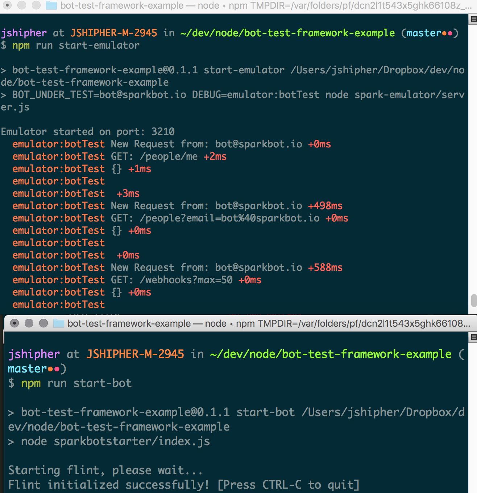
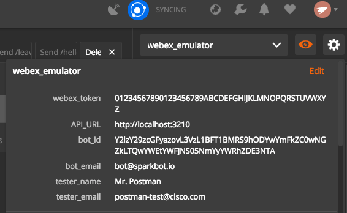
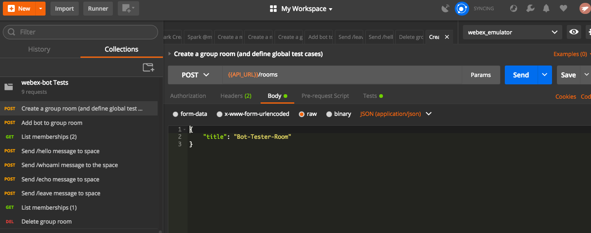
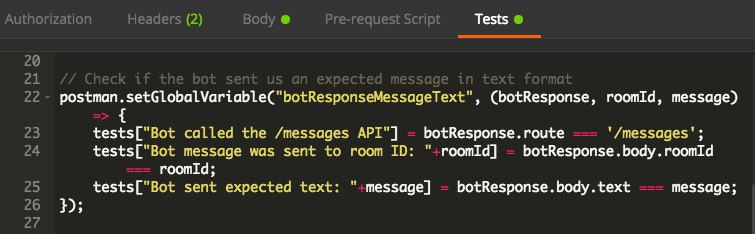
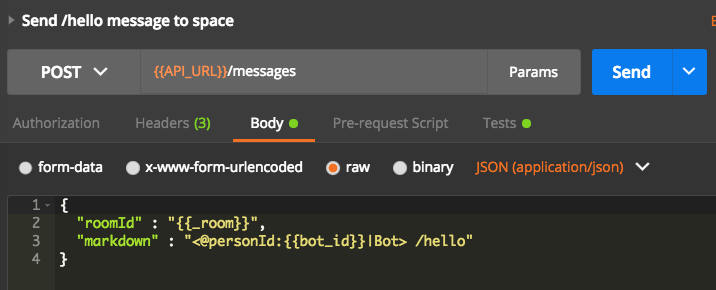
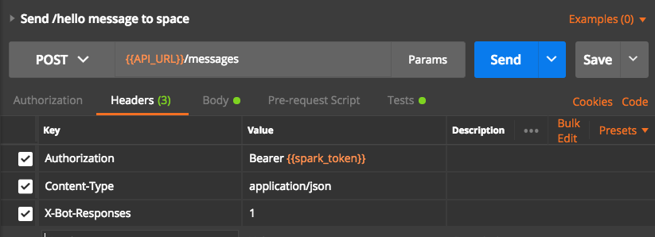
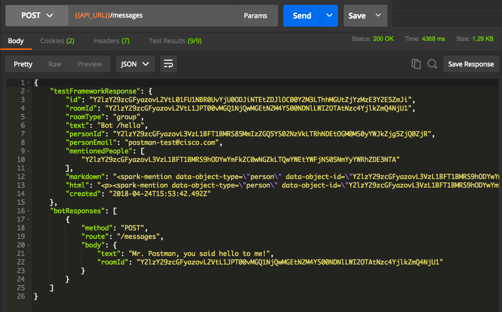
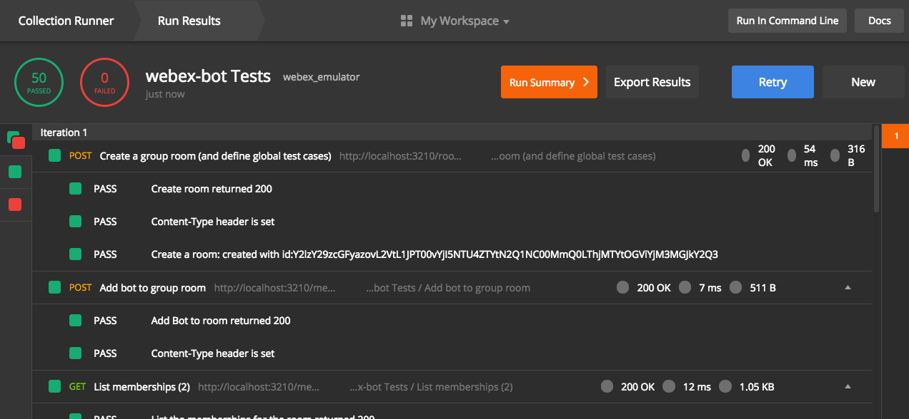

# bot-test-framework-example
This project provides an example of how to build and run regression tests to validate the behavior of a Cisco Spark Bot.

To test your own bot, you do not need to run this entire project, only clone the subproject https://github.com/webex/webex-api-emulator.   However, this project does contain a sample bot under test as well as some sample test cases that developers may find instructional as they begin to build test cases for their own bots.

In general the testing works as follows:
  - Bot is configured to talk to an instance of the Webex API Emulator, rather than the actual Webex For Developers API endpoint.
  - The Webex API Emulator is configured to run in "bot test mode".  When in this mode it inspects incoming requests for an X-Bot-Responses header.   For requests that have this header, the emulator intercepts the responses that would normally be sent back to the testing application and waits for the specified number of bot requests to come in.   Each time a correlated bot request is sent to the emulator (correlation generally is done via the roomId), the request information is captured and added to the body of the stored response.   When the number of bot requests specified in the X-Bot-Responses header are made, the consoldiated response is sent back to the testing framework
  - The Testing Framework (this sample uses Postman, but any framework that can send REST requests and inspect the results will do), then inspects the responses to each request, ensuring that the expected bot requests were made

The following sections walk through how to configure the emulator to run in "bot test mode", how to modify a bot in order to make it "testable", and finally how to write and run tests that emulate Webex Teams user actions to ensure that the bot responds as expected.

Because this project uses git submodules you may need to manually update them to get the webex-api-emulator and webex-bot-node projects populated, depending on the version of git you are running.  If these directories are empty, from the root directory of this project run the command:

    git submodule update --init --recursive

Both the emulator and the sample bot are node.js applications so you will need to have node and npm installed to run the samples.

## Configuring the emulator to run in "bot test mode".
This project includes a submodule which links to the https://github.com/webex/webex-api-emulator project.   It is already configured to run in test mode for the bot in this sample, but this was done by doing the following:

1) Edit [webex-api-emulator/tokens.json](webex-api-emulator/tokens.json) to include an identity for the bot under test.   Developers should never specify real authorization tokens in tokens.json, but simply strings that the emulator can validate in order to permit clients to make requests against it.   In our case the bot token looks like this:

```
    "ZYXWVUTSRQPONMLKJIHGFEDCBA9876543210": {   // This is the authrorization token for the bot
        "id": "Y2lzY29zcGFyazovL3VzL1BFT1BMRS9hODYwYmFkZC0wNGZkLTQwYWEtYWFjNS05NmYyYWRhZDE3NTA",
        "emails": [
            "bot@sparkbot.io"
        ],
        "displayName": "Bot",
        "nickName": "bot",
        "firstName": "spark",
        "lastName": "bot",
        "avatar": "https://cdn-images-1.medium.com/max/1000/1*wrYQF1qZ3GePyrVn-Sp0UQ.png",
        "orgId": "Y2lzY29zcGFyazovL3VzL09SR0FOSVpBVElPTi8xZWI2NWZkZi05NjQzLTQxN2YtOTk3NC1hZDcyY2FlMGUxMGY",
        "created": "2017-07-18T00:00:00.000Z",
        "type": "bot"
    },
```

2) Edit [webex-api-emulator/tokens.json](webex-api-emulator/tokens.json) to include an indentity for the test framework.  In our case this identity looks like this:
```
    "01234567890123456789ABCDEFGHIJKLMNOPQRSTUVWXYZ": {  // this is the auth token for the test client
        "id": "Y2lzY29zcGFyazovL3VzL1BFT1BMRS85MmIzZGQ5YS02NzVkLTRhNDEtOGM0MS0yYWJkZjg5ZjQ0ZjQ",
        "emails": [
            "postman-test@cisco.com"
        ],
        "displayName": "Mr. Postman",
        "nickName": "Posty",
        "firstName": "Post",
        "lastName": "Man",
        "avatar": "https://cdn-images-1.medium.com/max/1600/1*Iel5Q6qAxgBdl_IHUx3scA.jpeg",
        "orgId": "Y2lzY29zcGFyazovL3VzL09SR0FOSVpBVElPTi8xZWI2NWZkZi05NjQzLTQxN2YtOTk3NC1hZDcyY2FlMGUxMGY",
        "created": "2017-07-18T00:00:00.000Z",
        "type": "person"
    }
```

3) Configure the following environment variables before starting the emulator:
    - BOT_UNDER_TEST -- this is set to the email of the bot being tested.   We use bot@sparbot.io as specified in the tokens.json file in step 1 above.   When this environment variable is set the emulator runs in "bot test mode" and will inspect requests and potentially intercept responses that come from the bot in response to test input.
    - DEBUG="emulator:botTest"  -- (Optional).   When set the emulator writes out the details of each request and information about when responses are being intercepted and modified.   This mode is useful when writing test cases as it allows the developer to see the details of the requests that a bot will make in response to given test input.   

In our case we set these variable in [package.json](./package.json) as follows:
```
  "scripts": {
    "start-emulator": "BOT_UNDER_TEST=bot@sparkbot.io DEBUG=emulator:botTest node spark-emulator/server.js",
  },
```
## Running the emulator to run in "bot test mode".
Open a terminal window to run the emulator.

1) Make sure all the emulator dependencies are downloaded.  This is necessary only the first time after installing the project locally:

    ```npm run emulator-dependencies```

    (Note that windows users may need to manually change to the webex-api-emulator directory and run "npn install" from there.)

2) Start the emulator with the environment variables set as described in the previous section:

    ```npm run start-emulator```

    (Note that windows users may need to manually set the BOT_UNDER_TEST and DEBUG environment variables, as described above, and the run "npn start" from the webex-api-emulator directory)

## Preparing the bot for testing.

This project includes a submodule webex-bot-node which provides a node based Webex Teams bot based on the [sparkbotstarter project] (https://github.com/valgaze/sparkbotstarter), which demonstrates how to create a simple bot using the node-flint bot framework.   Testing can work with any Webex Teams bot written in any framework where the developer has the ability to configure the address of the Webex API instance that the bot interacts with.    We chose the webex-bot-node project since the spark-emulator and the postman test cases we use in this example all use node.js or javascript.    

Preparing a bot for testing requires the following steps.  These steps are already done for you for you in this sample, but you will need to do these to your own bot in order to run tests against it.   The details of how this is done will differ depending on which bot framework you are using, and how you configure details such as the webhook URL and auth token for your bot.

1) Configure the bot to use a token specified in the tokens.json file of webex-api-emulator project.   In our sample we see the following line in [webex-bot-node/config.json](webex-bot-node/config.json):

    ```"token": "ZYXWVUTSRQPONMLKJIHGFEDCBA9876543210"```

    This correlates to the bot identity set in tokens.json as described in the previous section on configuring the emulator.

2) Assuming that you will run the emulator on the same machine where your bot under test is running, and that the bot framework  you use configures the webhooks it needs automatically, configure the bot to receieve its webhooks on localhost.   The emulator will then send webhooks directly to the bot under test.   In our sample we see the following line in [webex-bot-node/config.json](webex-bot-node/config.json):

    ```"webhookUrl": "http://localhost"```

3) Configure your bot to send spark requests to the emulator instead of to the public Webex For Developers endpoint.   It is possible that your bot framework does not have a mechanism to do this today and you will need to modify your bot code, or even possibly your bot framework to do this.   As we are using the latest and greatest version of [Flint](https://github.com/flint-bot/flint) (version 4) we can do this simply by setting the apiUrl in the config object as see in this line from [webex-bot-node/config.json](webex-bot-node/config.json):

    ```"apiUrl": "http://localhost:3210/"```

## Running the bot in test mode.
After ensuring that your bot is configured as described above, make sure that the emulator is up and running.  Open a terminal window to start the bot as follows:

1) Make sure all the bot dependencies are downloaded.  This is necessary only the first time after installing the project locally:

    ```npm run bot-dependencies```

    (Note that windows users may need to manually change to the webex-bot-node directory and run "npn install" from there.)

2) Start the emulator with the environment variables set as described in the previous section:

    ```npm run start-emulator```

When you have both the emulator and bot running you should have two terminal windows that look something like this:



## Test Cases

Ok.  We've got the emulator and the bot running, now we can dig into what you came here for...test cases!

The easiest way to understand the test cases is to load them into [Postman](https://www.getpostman.com/).  If you don't have or don't like Postman you can likely follow along with the test cases in JSON format as well, but you will need to build your own framework for sending the requests and evaluating the responses.   For this overview, we'll assume you are using a local version of Postman. 

Load the provided test cases and postman environment into your Postman instance by choosing Import from the File Menu and import the two files [test-cases/WebexBotTests.postman_collection.json](test-cases/WebexBotTests.postman_collection.json), and [test-cases/webex_emulator.postman_environment.json](test-cases/webex_emulator.postman_environment.json).  One file will create a collection called webex-bot Tests.   We'll look at that in detail in a moment.   The other creates an environment called webex_emulator.   Let's look at the environment that we have defined.  To inspect this in postman, select the webex_emulator from the environment dropdown in the upper right hand corner:



Clicking on the "eye icon" shows the following variables:

- webex_token -- a token specified in tokens.json for the spark emulator
- API_URL -- the url where the spark emulator is running, ie http://localhost:3210
- bot_id -- the id of the bot being tested.  Specified in [spark-emulator/tokens.json](spark-emulator/tokens.json)
- bot_email -- the email ID of the bot that will be tested.   Specified in [spark-emulator/tokens.json](spark-emulator/tokens.json)
- tester_name -- the name of the user running the tests.  This is for a user other than the bot who is specified in [spark-emulator/tokens.json](spark-emulator/tokens.json)
- tester_email -- the email of the user running the tests.  Specified in [spark-emulator/tokens.json](spark-emulator/tokens.json)

The values configured should work out-of-the-box for this sample.   If you needed to edit them clicking on the orange "Edit" link allows you to od this

After ensuring that you have activated this environment (and that your bot and webex api emulator are running), you are ready to run your first test.   If you aren't familiar with Postman, requests are stored in a "Collection".  Each request has a title, a spot to define the request type and endpoint, and under that several tabs.  



As we built our collection we have often updated the Headers, Body, and the Tests tabs, the green element in the postman UI indicates that there is something interesting here.  Tests, created on the Tests tab, are written in javascript and allow you to programmatically evaluate the responses to each request.   This blogpost provides a good overview of how Postman based testing works: http://blog.getpostman.com/2017/10/25/writing-tests-in-postman/

You'll find the following in your new SparkBotStarter Tests collection:

1) **Create a group room (and define global test cases)**:   This is a fairly "standard" test case, in that just sends a POST to the /rooms endpoint to create the Webex Teams space that our test harness and bot will be messaging back and forth in.   The bot is not a member yet, so we don't expect any response from the bot, however there are some interesting global functions defined in the Test tab of the test.   Lets look at one of these by clicking on the "Test" tab in Postman:

    

    Here we create a generic botResponseMessageText function which we can call in the tests for subsequent reqests.  When we call it we pass in the botResponse that was in the response body, the message text that we expected the bot to send, and the roomId that we expected the bot to send it to.  If the botResponse request was not to the /messages endpoint and/or the roomId or message text is not as expected, the appropriate test will fail.   

    This is one of several tests methods defined here, others inspect markdown messages, or simply do some grunt work to confirm that the emulator returned a 200 OK response.

    Its important that this test be run before the others since the tests will not work if these functions are not defined.

2) **Add bot to group room**:   This is also a fairly "standard" test as it just adds the bot to our space.  The webex-bot in this sample project does not respond in any way when being added to a space so there are no expected Bot responses here either.

3) **List memberships (2)**:  This test is also "standard" in that it validates that the Spark emulator returns two memberships, one for the tester account and one for the bot, in the newly created space.

4) **Send /hello message to space**:  Ok, now we are doing something interesting.   In the body of this message we are mentioning the bot since bots can only see messages when they are mentioned in a group space.   The API emulator does not do a great job of handling emails yet, so we mention the bot explicitly with its id (as defined in [webex-api-emulator/tokens.json](webex-api-emulator/tokens.json)).  Since we want to say "/hello", the body of the message request looks like this:

    
    
    Note that in Postman's syntax an environment variable enclosed in double brackets is replaced by that variable's value.  The "_room" environment variable was set when we ran our tests on the response for our first test case.  The "bot_id" was set in our webex_emulator environment.

    But of course the interesting part of this test is that we've introduced a new header (via the headers tab) called "X-Bot-Responses" and set the value to 1. 

      
    
    The first two headers are needed for any Webex API request:  "Authorization" sends our auth token (the one we set in [webex-api-emulator/tokens.json](webex-api-emulator/tokens.json), and defined in the webex_emulator environemnt), "Content-Type" tells the emulator that this POST has a JSON body.   You'll see this pattern in all of the tests.
    
    The "X-Bot-Responses" header with a value of "1" is the header that tells the spark emulator to intercept the response to our messages request and to hold it until it gets one request from the bot.   Since this is happening these tests may take a few seconds to run.   Assuming all is well and the bot is behaving properly postman will eventually get a response that looks something like this:

    

    Here we finally get a glimpse of the API Emulator's response to a bot test mode request.   The response is made up of two objects.
    * testFrameworkResponse: is the original response to the POST request that we made to the /messages endpoint.   Had we not set the "X-Bot-Responses" header, the body of this object would be all that was returned.
    * botResponses is an array of subsequent requests that the bot made in response to the original message we sent.   Since we set the X-Bot-Response header to one, there is just one request in this array.  We'll see an example of multiple responses later.

    Also note that the there is a green (9/9) next to the "Test Results" above the response body.  Now that we understand what the response looks like, lets take a look at the test cases.  For readability we'll eschew the Postman screenshot and simply dump the code that is in the Tests tab for this request.  Let's spend a little time reviewing what is happening with these tests:

    ```
    // First, run the common tests
    eval(globals.commonTests)("Send help message to the bot", 200);

    // Check that we got the combined spark API and bot response payload
    eval(globals.bodyIncludesBotResponsesTest)()

    // Check if we got the expected message from the bot

    var jsonData = JSON.parse(responseBody);
    var testFrameworkResponse = jsonData.testFrameworkResponse;
    var botResponses = jsonData.botResponses;

    var roomId = postman.getEnvironmentVariable("_room");
    var expectedResponses = request.headers['x-bot-responses'];
    if (botResponses.length == expectedResponses) {
        tests["Bot responded with " + expectedResponses + " requests:"] = true;
        var botResponse = jsonData.botResponses[0]
        var testerName = postman.getEnvironmentVariable("tester_name");
        var resultMsg = testerName + ', you said hello to me!';
        eval(globals.botResponseMessageText)(botResponse, roomId, resultMsg);
    } else {
        tests["Bot responded with " + expectedResponses + " requests:"] = false;
    }
    ```
    The first eval of globals.commonTests simply makes sure that we got the expected response code to our original request.  The next eval of the globals.bodyIncludesBotResponsesTest makes sure that the response includes both the testFrameworkResponse object and an array of botResponses, which are actually request(s) that the bot made in response to our test input.   Remember, if you'd like to see the code for the functions you can inspect the Tests tab on the first "Create a group room (and define global test cases)" request, or you can view the code directly in the [postman collection json](test_cases/WebexBotTests.postman_collection.json).

    Finally, the eval of globals.botResponseMessageText, checks to see that the bot request was to the messages endpoint, for our room, and matched our expected text.   This is the meat of the test framework.   Once you understand this you can develop tests for any given input to your bot building up a regression test that you can run whenever your bot changes.  Remember, we defined all of these test functions in the Tests tab of the very first "Create a group room (and define global tests) request.

5) **Send /whoami message to the space**:  This test follows the same model set up in the previous test.  For this particular input we expect the bot to reply with two messages so we set X-Bot-Responses to 2.   The test cases look similar to the previous test but since we expect markdown we eval the globals.botResponseMessageMarkdown function two times, once for each response in the botResponses array.

6) **Send /echo message to space**:  Very similar to test 4 with different input and expected output.

7) **Send /leave message to space**:  In this command we expect two bot responses but only one message.  The second response is a DELETE request sent to the memberships API.   The test case validates that this is what was recieved

8) **List memberships (1)**:  This "standard" test doesn't look for any bot responses, it simply validates that the bot is no longer a member of the space.

9) **Delete group room**:  Cleans up our environment.

Thats it.  Spend some time running the tests, looking at the responses and the output of the tests.   Just as Postman has a Tests tab in the Request section, it has one in the Response section as well.  I find it handy to first look at the response, and then switch over to the Tests tab to see which tests passed and which tests failed.

## Building your own tests
Once you have the hang of how Postman tests work, and what the X-Bot-Responses header does, you should be able to start writing test cases for your own bot.   You'll need to configure your own bot to talk to the spark emulator as described above.   So far we have only provided an example bot using the node-flint framework, but we'd love to get feedback or samples from users on how to do this with other frameworks.

Once you have your bot talking to the spark emulator, I find it useful to run the emulator with DEBUG=emulator:botTest (which happens automatically if you start the emulator using the npm run start-emulator command).  In this mode you can see all of the requests being sent to it and watch the responses the the bot sends after input from Postman.   Using this you can start to experiment with setting the X-Bot-Responses header and creating test cases that will validate the response specific to your bot.

As you begin to create test cases and set the X-Bot-Responses header you may find circumstances where the bot DOESN'T send a response to your message, but the emulator is still waiting for it.   In cases like this I find it simplest to stop both the bot and the emulator and then restart the emulator and the bot (in that order!).  This gets us back to a "clean slate" and you can either adjust your X-Bot-Responses header or do some troubleshooting on your bot.

## Running your regression tests
Once you are confident that your tests are working properly, its time to get into the habit of running the tests regularly.  Postman has a tool called Runner (click the Runner button on the main widow) which allows you to select a collection and environment and run all the tests automatically.  To run our tests in the runner choose our webex-bot Tests collection, choose "webex_emulator" in the environment dropo down and click the "Run webex-bot Tests" button.

Here's a sample output of the Runner running our tests:



Postman also supplies a CLI tool called [newman](https://www.npmjs.com/package/newman) which allows you to run tests from the command line.   If you've got it installed, this sample project includes the following npm command to run the tests in CLI mode:

    ```npm test```

Just make sure that the emulator and configured bot are both running before running the test.

## Limitations
There are still several known limitations to testing bots with this framework.   Among them are:
- Correlation of bot requests to test input is currently done only via roomId (or bot membership in room for membership events).   This means that the test framework cannot send a second request that impacts the same room as the first request before the first response is returned.   
- There is currently no way correlate bot behaviors that dont take place in the same room as the test request.   This means that if (for example) a bot responds to a message being sent in one room by sending messages to another room, there is no way to capture this in the framwork today.
- There is currently no way to test external events that generate bot responses since the test framework depends on the initial request coming into the spark emulator

We have a strategy to extend the emulator to support a "test tracking ID" and are working with bot framework developers to plumb this back into subsequent bot requests in order to create a more precise way to correlate test input with subsequent bot requests, which should address some of these limitations.   Watch this space!

If you find other limitations please report them as issues. 
